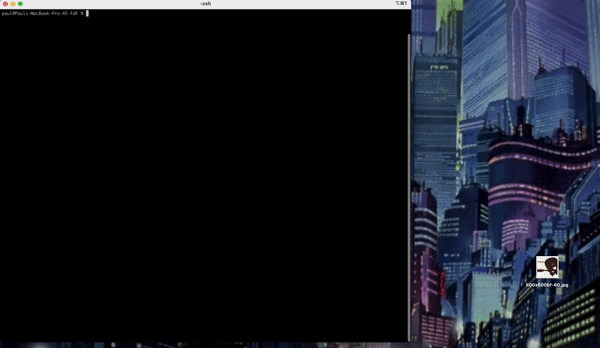

**FdF is part of the second milestone of the 42 Common Core**

The PDF of the original subject is attached.

The goal is to build a wireframe 3D landscape viewer in C using a basic graphics library called MiniLibX.

	

